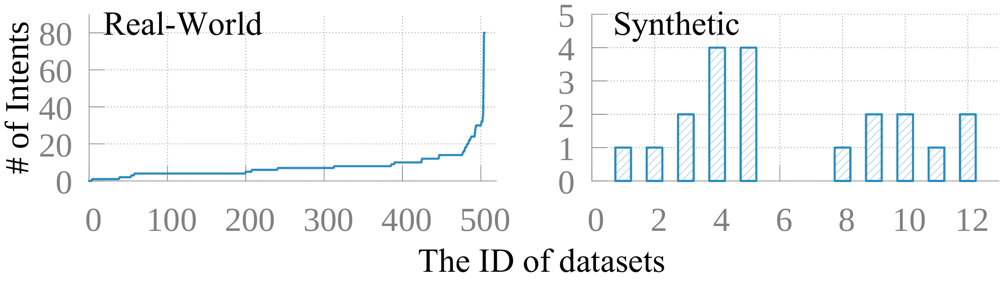
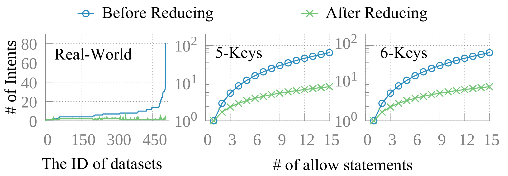
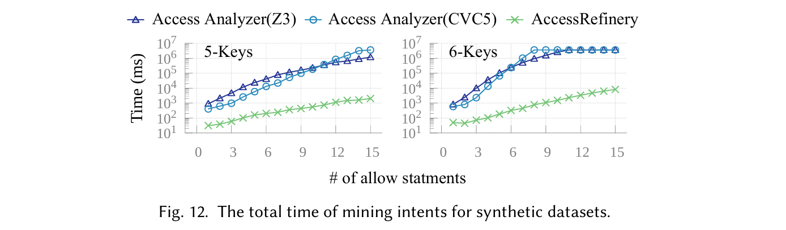
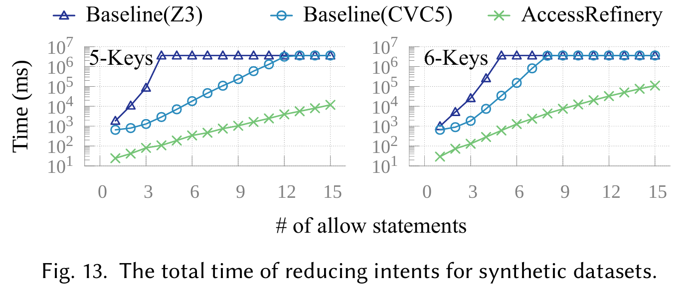
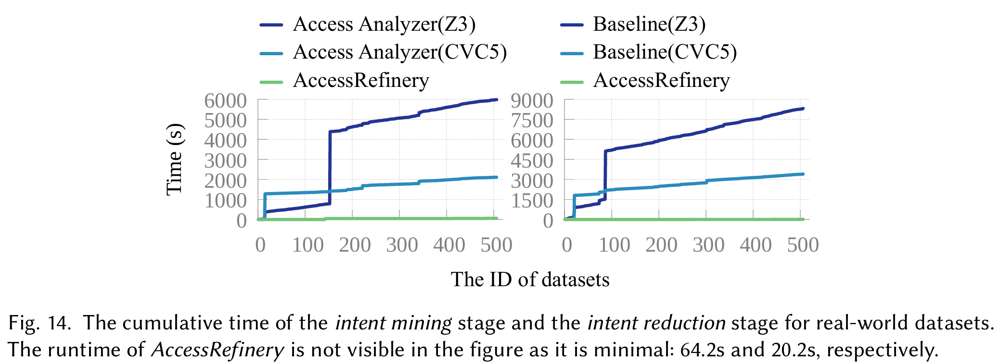
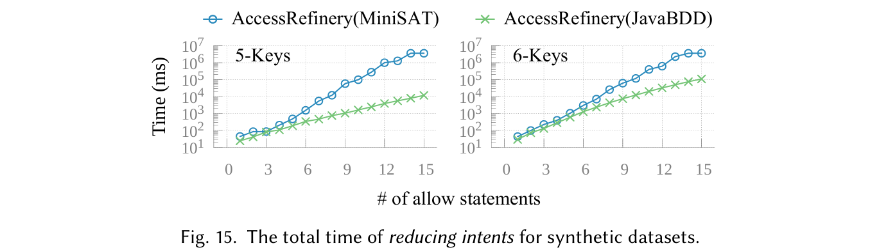
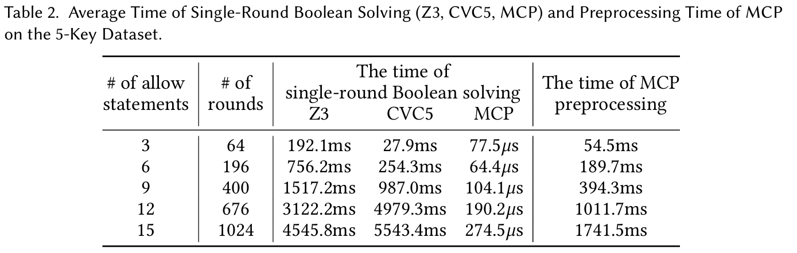

# AccessRefinery: Fast Mining Concise Access Control Intents on Public Cloud

by [Ning Kang](https://xjtu-netverify.github.io/people/nkang/), [Peng Zhang](https://xjtu-netverify.github.io/people/pzhang/), [Jianyuan Zhang](https://xjtu-netverify.github.io/people/jyzhang/), Hao Li, Dan Wang, Zhenrong Gu, Weibo Lin, Shibiao Jiang, Zhu He, Xu Du, Longfei Chen, Jun Li and Xiaohong Guan.

   

## About Artifact

This repository contains the artifacts for the FSE 2026 paper titled ["AccessRefinery: Fast Mining Concise Access Control Intents on Public Cloud"](https://xjtu-netverify.github.io/papers/AccessRefinery/accessrefinery_final_version.pdf). *AccessRefinery* speeds up intent mining for IAM (Identity and Access Management) policies and reduces redundancy in the mined intents. Its speedup is achieved by reducing redundancy in multi-round SMT solving through a *Multi-Theory Constraint Preprocessor (MCP)* that transforms SMT constraints into bit-vector representations. For intent reduction, *AccessRefinery* computes a compact set of intents that covers all mined intents by solving a minimum set-cover problem. Compared with the [AWS Access Analyzer](https://link.springer.com/content/pdf/10.1007/978-3-030-53288-8_9.pdf) baseline, *AccessRefinery* achieves about 10–100× speedup and reduces the number of intents by up to 10×. This artifact includes the full implementations of *AccessRefinery* and the baseline reimplementation, along with datasets, archived results, experiment scripts, and plotting scripts to reproduce the paper's main claims. Additionally, we designed *MCP* as a reusable data structure that may also benefit other studies.

## Status

We are applying for the following FSE 2026 Artifact Evaluation badges:

### Evaluated - Functional

We believe this artifact satisfies the Functional criteria based on the following evidence:

- **Documented:** The artifact includes documentation on:
  - Requirements
  - Installation
  - Project structure
  - Usage and examples
  - Reproduction scripts and instructions
  - API documentation generated by Javadoc
  - Running instructions in VS Code for developers
- **Exercisable:** Users can execute the system from source using standard Maven workflows with JDK 17.
- **Complete:** The artifact includes all materials required to reproduce the reported experiments:
  - Source code for *AccessRefinery*
  - Source code for the reimplementation of *Access Analyzer* (*AWS Access Analyzer* is not open source and only provides a CLI API.)
  - Scripts for invoking *AWS Access Analyzer* via the CLI
  - Three synthetic datasets (real-world datasets are not publicly available due to commercial restrictions)
  - Reproduction scripts and instructions
  - Plotting scripts
- **Consistent with the paper:** We provide archived results and instructions for reproducing the claims reported in the paper.

### Evaluated - Reusable

We believe this artifact satisfies the Reusable criteria for the following reasons:

- **Reuse and repurposing of MCP (library-level reuse):**
  - **Modular design:** *MCP* is designed as a data structure. Running `mvn package` at the repository root generates `mcp-1.0.jar`, which can be directly imported into other Java projects.
  - **Easy-to-use Java API and examples:** *MCP* supports Java-style chained Boolean operations, for example, `policy.not().and(intent1.or(intent2))`. We also provide usage examples.
  - **General Design:** *MCP* uses a general design for multiple variable types, including regex (RegexpLabel.java), prefix (PrefixLabel.java), range (RangeLabel.java), and set (IntegerSetLabel.java). These types are mapped to a unified superclass (Label.java) via Java polymorphism. *MCP* then performs processing (e.g., equivalence-class partitioning and bit-vector encoding) on the unified superclass. This design facilitates extension to additional variable types.
  - **Standardized API documentation:** We provide standardized comments in the *MCP* source code, enabling automatic Maven documentation generation. See [GitHub Page](https://916267142.github.io/mcp.github.io/).

- **Reuse and repurposing of AccessRefinery (tool-level reuse):**
  - **Easy-to-use command-line API and examples:** Running `mvn package` at the repository root generates `accessrefinery-1.0.jar`. It provides command-line parsing support. For example, `java -jar target/accessrefinery-1.0.jar -m -r --sat --round 10 -f data/Correctness` automatically runs 10 rounds to compute the average runtime, and `--sat` indicates that MiniSAT is used instead of BDD to represent bit-vectors. We also provide usage examples.
  - **Standardized API documentation:** We provide standardized comments in the *AccessRefinery* source code, enabling automatic Maven documentation generation. See [GitHub Page](https://xjtu-netverify.github.io/accessrefinery.github.io/).

### Available

We believe this artifact satisfies the Available criteria because it is publicly available on Zenodo and GitHub.

## Environment Setup

For artifact evaluation reviewers, we provide a cloud server that can be accessed via SSH, so **Download Artifact**, **Requirements**, **Installation** can be skipped.

```shell
ssh ...
... # password
cd accessrefinery
```

### Download Artifact

We provide two ways to access the artifact:

- Archived version: [Zenodo repository](https://github.com/xjtu-netverify/AccessRefinery.git)

After downloading the archive, extract it with:

```
unzip accessrefinery-1.0.zip -d accessrefinery
```

- Maintained version: [GitHub repository](https://github.com/XJTU-NetVerify/accessrefinery.git)

```
git clone https://github.com/XJTU-NetVerify/accessrefinery.git
```

### Requirements

- Hardware Requirements
  - RAM: ≥ 32 GB
  - Storage: ≥ 50 GB
- Software Requirements
  - Linux Ubuntu 22.04 LTS
  - Java JDK 17
  - Maven 3.6.3
  - jq 1.6
  - gnuplot 5.4
  - SMT solver Z3 4.14.2 (for running baseline)
  - SMT solver CVC5 1.2.1 (for running baseline)

### Installation

- Prepare a Linux system (recommend [Ubuntu 22.04.5](https://releases.ubuntu.com/jammy/ubuntu-22.04.5-desktop-amd64.iso))

- Install JDK 17:

```bash
sudo apt install openjdk-17-jdk
```

Add Java to the environment variables (recommended):

```bash
echo 'export JAVA_HOME=/usr/lib/jvm/java-17-openjdk-amd64' >> ~/.bashrc
echo 'export PATH=$JAVA_HOME/bin:$PATH' >> ~/.bashrc
source ~/.bashrc
javac -version
java -version
```

Expected output:

```shell
javac 17.0.17
openjdk version "17.0.17" 2025-10-21
OpenJDK Runtime Environment (build 17.0.17+10-Ubuntu-122.04)
OpenJDK 64-Bit Server VM (build 17.0.17+10-Ubuntu-122.04, mixed mode, sharing)
```

- Install Maven:

```bash
sudo apt install maven
mvn -v
```

Expected output:

```shell
Apache Maven 3.6.3
Maven home: /usr/share/maven
Java version: 17.0.17, vendor: Ubuntu, runtime: /usr/lib/jvm/java-17-openjdk-amd64
Default locale: en_US, platform encoding: UTF-8
OS name: "linux", version: "6.8.0-90-generic", arch: "amd64", family: "unix"
```

- Install `jq` for JSON processing:

```bash
sudo apt install jq
jq --version
```

Expected output:

```shell
jq-1.6
```

- Install `gnuplot` for plotting figures:

```bash
sudo apt install gnuplot
gnuplot --version
```

Expected output:

```shell
gnuplot 5.4 patchlevel 2
```

- Install `Z3`:

`Z3` is already precompiled. Run the following script to automatically copy the `Z3` executable and libraries to the required directories.

```bash
sh tools/install_z3.sh
```

Expected output:

```shell
Copied Z3 files to:
- /usr/lib
- /usr/bin
- /home/nkang/.local/bin
Added LD_LIBRARY_PATH to ~/.bashrc
Z3 version 4.14.1 - 64 bit
Z3 installation is correct.
```

Moreover, CVC5 is installed automatically during project compilation.

### Build

In the root directory, run:

```bash
mvn clean package
```

The build generates the following JAR packages in `target/`:

- `mcp-1.0.jar` for *MCP*, which can be reused in other projects for fast multi-round SMT solving.
- `accessrefinery-1.0.jar` for *AccessRefinery*.
- `accessanalyzer-1.0.jar` for the *reimplemented Access Analyzer*.

## Project Structure

Since *AWS Access Analyzer* is not open source and provides only a Command-Line Interface (CLI), we also reimplement Access Analyzer for evaluation. We distinguish the two versions as the *reimplemented Access Analyzer* and the *CLI-based Access Analyzer*.

- `data/`:
  - `Correctness/`: Dataset for correctness experiments.
  - `Scalability_05Keys/`: Synthetic dataset for scalability experiments.
  - `Scalability_06Keys/`: Synthetic dataset for scalability experiments.
- `accessrefinery/`: Implementation of *AccessRefinery*.
  - `bdd/`: Implementation of the binary decision diagram backend used by MCP.
  - `mcp/`: Implementation of the *Multi-Theory Constraint Preprocessor* (*MCP*).
  - `refinery/`: Implementation of intent mining and reduction.
- `baselines/`:
  - `accessanalyzer-reimpl`: Reimplementation of *Access Analyzer*.
  - `accessanalyzer-cli`: Scripts for invoking *AWS Access Analyzer* via CLI.
- `pom.xml`: Maven root configuration.
- `tools/`: Scripts for running the experiments.
- `docs/`:
  - `mcp-javadoc`: Javadoc for *MCP*.
  - `accessrefinery-javadoc`: Javadoc for *AccessRefinery*.
- `paper_figures/`: Scripts for plotting the figures in the paper.
- `archive_results/`: Archived experimental results.

## Using Multi-Theory Constraint Preprocessor (MCP)

*MCP* is a data structure for fast multi-round SMT solving. It supports regular expressions, IP prefixes/bit-vectors, ranges, and sets.

### Reuse in Another Project

Install `target/mcp-1.0.jar` into your local Maven repository:

```bash
mvn install:install-file \
    -Dfile=target/mcp-1.0.jar \
    -DgroupId=org.ants \
    -DartifactId=accessrefinery \
    -Dversion=1.0 \
    -Dpackaging=jar \
    -DgeneratePom=true
```

Then add the dependency to your `pom.xml`:

```xml
<dependencies>
    <dependency>
        <groupId>org.ants</groupId>
        <artifactId>accessrefinery</artifactId>
        <version>1.0</version>
    </dependency>
</dependencies>
```

### Example

This section illustrates how to use *MCP* with the example in the paper (line 414). The code is included in [MCPFactoryTest.java](https://github.com/XJTU-NetVerify/accessrefinery/blob/main/accessrefinery/mcp/src/test/java/org/mcp/core/MCPTest.java), and *MCP* is imported as a Maven dependency. Running the following command automatically executes this example.

**Running:**

```
mvn test -pl ./accessrefinery/mcp -Dtest=MCPFactoryTest.java#testMCPFactory
```

**Expected output:**

```text
[INFO] ------------------------------------------------------------------------
[INFO] BUILD SUCCESS
[INFO] ------------------------------------------------------------------------
[INFO] Total time:  1.579 s
[INFO] Finished at: 2026-04-10T22:58:08+08:00
[INFO] ------------------------------------------------------------------------
```

The following section explains the example in detail. Suppose we have the following IAM policy and a target intent, `Intent_6` (`Resource`: `dept*/user1.txt`, `IpAddress`: `112.0.0.0/24`).

```json
{
    "Statement": [
        {
            "Effect": "Allow",
            "Resource": ["dept*/user1.txt", "dept1/user*.txt"],
            "Condition": {
                "IpAddress": {
                    "aws:SourceIp": ["112.0.0.0/24", "113.0.0.0/24"]
                }
            }
        },
        {
            "Effect": "Deny",
            "NotResource": "dept1/user*.txt",
            "Condition": {
                "IpAddress": {
                    "aws:SourceIp": "112.0.0.0/24"
                }
            }
        },
        {
            "Effect": "Deny",
            "NotResource": "dept*/user1.txt",
            "Condition": {
                "IpAddress": {
                    "aws:SourceIp" : "113.0.0.0/24"
                }
            }
        }
    ]
}
```

To check the satisfiability of three formulas, $\neg I_6 \land P$, $I_6 \land \neg P$, and $I_6 \land P$, we use the following code based on *MCP*.

```java
package com.example;
import org.batfish.datamodel.Prefix;
import org.junit.Assert;
import org.mcp.core.MCPBitVector;
import org.mcp.core.MCPFactory;
import org.mcp.core.MCPFactory.MCPType;
import org.mcp.variables.statics.LabelType;

public class Main {
    public static void main(String[] args) {
        MCPFactory mcp = new MCPFactory(MCPType.BDD);
        mcp.addVar("Res", LabelType.REGEXP, "dept*/user1.txt");
        mcp.addVar("Res", LabelType.REGEXP, "dept1/user*.txt");
        mcp.addVar("IP", LabelType.PREFIX, Prefix.parse("112.0.0.0/24"));
        mcp.addVar("IP", LabelType.PREFIX, Prefix.parse("113.0.0.0/24"));
        mcp.updates();

        MCPBitVector res1 = mcp.getVar("Res", "dept*/user1.txt");
        MCPBitVector res2 = mcp.getVar("Res", "dept1/user*.txt");
        MCPBitVector ip1 = mcp.getVar("IP", Prefix.parse("112.0.0.0/24"));
        MCPBitVector ip2 = mcp.getVar("IP", Prefix.parse("113.0.0.0/24"));
        MCPBitVector s1 = (res1.or(res2)).and(ip1.or(ip2));
        MCPBitVector s2 = res1.not().and(ip1);
        MCPBitVector s3 = res2.not().and(ip2);
        MCPBitVector policy = s1.diff(s2).diff(s3);
        MCPBitVector intent6 = res1.and(ip1);

        // ¬I6∧P is satisfiable.
        Assert.assertTrue(!policy.and(intent6.not()).isZero());
        // I6∧¬P is unsatisfiable.
        Assert.assertTrue(policy.not().and(intent6).isZero());
        // I6∧P is satisfiable.
        Assert.assertTrue(!policy.and(intent6).isZero());
    }
}
```

## Using AccessRefinery

*AccessRefinery* builds on *MCP* for IAM intent mining and reduction. In this repository, *MCP* is already integrated into *AccessRefinery*, so you can use it directly without a separate installation.

To run *AccessRefinery*, use:

```shell
java -jar target/accessrefinery-1.0.jar [options]
```

**Command-line options:**

- `-h, --help` : Show help information.
- `-m, --mine` : Enable intent mining.
- `-r, --reduce` : Enable intent reduction.
- `-f, --file <path>` : Input path for policy files (must be under `data/`).
- `-s, --sat` : Use SAT to encode bit-vectors (default is BDD).
- `--round <number>` : Number of mining rounds (to reduce experimental bias).

**Running:**

```shell
java -jar target/accessrefinery-1.0.jar -m -r --round 1 -f data/Correctness
```

**Expected output:**

```cmd
[INFO] 2026-04-05 22:51:33 : ----------[ AccessRefinery Mode ]-------------
[INFO] 2026-04-05 22:51:33 : input  path: data/Correctness
[INFO] 2026-04-05 22:51:33 : output path: result/Correctness
[INFO] 2026-04-05 22:51:33 : ----------< 1th policy - 11_allow_allow_equal.json >-----------
[INFO] 2026-04-05 22:51:33 : [1/6]  finish parser policy
[INFO] 2026-04-05 22:51:33 : [2/6]  finish ECs calculation
```

Results are generated in the `result/Correctness/` directory and include:

- `xxx.json`: The intents for each policy.
- `xxx.csv`: Statistics for multi-round SMT solving for each policy.
- `summary.txt`: Summary statistics for all policies in a folder.

In addition, one file is generated in the current path:

- `accessrefinery.log` : Records the running log.

## Using Reimplemented Access Analyzer (Baseline)

To run *Access Analyzer*, use:

```bash
java -jar target/accessanalyzer-1.0.jar <options>
```

**Command-line options:**
- `-r, --reduce`: Reduce the number of intents.
- `-s, --solver <Z3/CVC5>`: Select the solver to use (Z3 or CVC5), default is Z3.
- `-f, --file <DATA_PATH>`: Path to the input policies (JSON file or folder).
- `-h, --help`: Show help message and exit.

**Running:**

```bash
java -jar target/accessanalyzer-1.0.jar -r -s Z3 -f data/Scalability_05Keys/01_allow.json
``` 

**Expected output:**

```text
[INFO] 2026-04-10 23:08:41 : ----------[ Shaky Jenga Tower Code ]-------------
[INFO] 2026-04-10 23:08:41 : logger path: /home/simple/workspace/accessrefinery-workspace/accessrefinery/miner.log
[INFO] 2026-04-10 23:08:41 : input  path: data/Correctness/11_allow_allow_equal.json
[INFO] 2026-04-10 23:08:41 : output path: result/Correctness/11_allow_allow_equal.json
[INFO] 2026-04-10 23:08:41 : ----------< Processing policy - 11_allow_allow_equal.json >-----------
[INFO] 2026-04-10 23:08:41 : [1/5]  finish parser policy
[INFO] 2026-04-10 23:08:41 : [2/5]  finish label tree calculation
[INFO] 2026-04-10 23:08:41 : [3/5]  finish findings mining : 1
[INFO] 2026-04-10 23:08:41 : [4/5]  finish atomic predicates calculation
```

Then the result will be output to the `results/` folder. For the file `<file_name>.json`, the tool will output a folder named `results/<file_name>.json/`, containing the following files:

- `<file_name>_<solver>_findings.json`: The mined intents in JSON format.
- `<file_name>_<solver>_time.csv`: The time spent in mining the intents.

## Evaluation Reproduction

This section describes (1) how to reproduce the results in `archive_results/`, and (2) how to map `archive_results/` to the corresponding figures, tables, and conclusions in the paper.

*We omit the results for the real-world datasets because of commercial restrictions.*

### Reproducing Archived Results

Running this part generates a `results/` directory. We archive its contents in `archive_results/` while preserving the same directory structure, which allows you to skip the following steps.

#### Reproducing AccessRefinery Archived Results

**Running:**

The following scripts invoke `target/accessrefinery-1.0.jar`.

```bash
# The execution takes about 6 minutes.
sh tools/accessrefinery/running_bdd_miner.sh

# The execution takes about 1 hour.
sh tools/accessrefinery/running_sat_miner.sh

# The execution takes about ???.
sh tools/accessrefinery/running_bdd_reducer.sh

# The execution takes about ???.
sh tools/accessrefinery/running_sat_reducer.sh
```

**Expected Output:**

- `results/`: All experiments are run for 10 rounds, and average time is reported.

  - `accessrefinery_bdd_miner_10rs/`: intent mining using JavaBDD.
  - `accessrefinery_sat_miner_10rs/`: intent mining using MiniSAT.
  - `accessrefinery_bdd_reducer_10rs/`: intent mining and reduction using JavaBDD.
  - `accessrefinery_sat_reducer_3rs/`: intent mining and reduction using MiniSAT (limited to 3 rounds due to slow execution).


#### Reproducing Reimplemented Access Analyzer Archived Results

**Running:**

The following scripts invoke `target/accessanalyzer-1.0.jar`.

```bash
# The execution takes about ???
@ after-the-end

# The execution takes about ???
@ after-the-end

# The execution takes about ???
@ after-the-end

# The execution takes about ???
@ after-the-end
```

**Expected Output:**

- `results/`: All results run for one round due to limited execution time.
  - `accessrefinery_z3_miner_1rs/`: intent mining using Z3 Solver.
  - `accessrefinery_cvc5_miner_1rs/`: intent mining using CVC5 Solver.
  - `accessrefinery_z3_reducer_1rs/`: intent mining and reduction using Z3 Solver.
  - `accessrefinery_cvc5_reducer_1rs/`: intent mining and reduction using CVC5 Solver.

#### Reproducing CLI-based Access Analyzer Archived Results

All previously mined intents are archived in the `archive_results/accessanalyzer_cli/` directory, which allows skipping the following step. The archived results can serve as the ground truth for subsequent correctness verification.

- **If you are using your own environment:**
  We strongly recommend skipping reproduction of results from the *CLI-based Access Analyzer*, as setup is complex and requires AWS account registration, billing configuration, and CLI credential setup. We still provide details in [AccessAnalyzerCLI.md](https://github.com/XJTU-NetVerify/accessrefinery/blob/main/baselines/accessanalyzer-cli/AccessAnalyzerCLI.md) for developers.

- **If you are using the provided cloud platform via SSH:**
  The environment is already configured, and you can test our scripts directly. However, because our original AWS account was suspended, the previous bucket name is no longer accessible. We migrated to a new account and created a new bucket accordingly. Therefore, generating archive results is not feasible. However, we can still verify the functionality of our script. Note that this script may still fail to run because our new AWS account may be suspended.

**Running**:

```bash
# The execution takes about 5 minutes.
sh baselines/accessanalyzer-cli/aws_batch.sh data/TestCLI
```

**Output directory:**

`results/accessanalyzer_cli/`

### Verifying Claims in the Paper

After generating the results, we explain how to reproduce the figures, tables, and conclusions reported in the paper.

#### 1. Target Conclusion (Line 750 in Section 5):

"*AWS provides an online Command Line Interface (CLI) for Access Analyzer, which we use to validate the correctness of our re-implementation. Specifically, for the 6-key dataset with 11 to 15 statements, both versions time out (> 1 hour). ...*"

**Steps:**

See `archive_results/accessanalyzer_cli/run.log` for the 10_allow_result.json case. AWS automatically terminated the mining process after `3386` seconds. This indicates that invoking *AWS Access Analyzer* via the CLI will time out on a 6-key dataset with 10 to 15 statements.

```test
[4/5] intents saved at ./aws_result/Scalability_06Keys//10_allow_result.json
[5/5] 2025-05-11 18:06:51: Total running time  : 3386 seconds
[5/5] 2025-05-11 18:06:51: Final intents count : 1
```

See the last line of `archive_results/accessanalyzer_z3_miner_1rs/Scalability_05Keys/summary.csv`. The final column value of `2596.6094` seconds indicates that only up to 10 statements were mined. This implies that the *reimplemented Access Analyzer* timed out when handling 11 to 15 statements.

```text
9,81,676,2.3068,1569.1607
10,100,881,2.9338,2596.6094
```

To this end, the conclusion holds.

#### 2. Target Conclusion (Line 751 in Section 5):

"*AWS provides an online Command Line Interface (CLI) for Access Analyzer, which we use to validate the correctness of our re-implementation. ... Both versions produce identical intents on the Correctness, 5-key, and 6-key datasets.*"

**Running:** 

The following command compares intents between the *reimplemented Access Analyzer* and the *CLI-based Access Analyzer*.

```
sh tools/accessanalyzer-reimpl/running_accessanalyzer_miner_compare.sh
```

**Expected Output:**

- `results/accessanalyzer_miner_compare_results/*.log`

#### 3. Target Conclusion (Line 760 in Section 6.1): 

"*We conducted a series of basic Boolean operation tests.*"

**Running:**

Running maven test for [MCPTest.java](https://github.com/XJTU-NetVerify/accessrefinery/blob/main/accessrefinery/mcp/src/test/java/org/mcp/core/MCPTest.java). 

```
mvn test -pl ./accessrefinery/mcp -Dtest=MCPTest.java#testComplexSATOperations
```

**Expected Output:**

```
[INFO] ------------------------------------------------------------------------
[INFO] BUILD SUCCESS
[INFO] ------------------------------------------------------------------------
[INFO] Total time:  1.212 s
[INFO] Finished at: 2026-04-10T17:10:38+08:00
[INFO] ------------------------------------------------------------------------
```

#### 4. Target Figure (Line 776 in Section 6.1): Figure 10  



**Required logs:**

Use the `NumberMCI` values in `accessrefinery_bdd_miner_10rs/Correctness/summary.txt` to plot Figure 10 of the paper.


**Running:** (Preserve the parentheses when executing the command.)
```shell
(cd paper_figures && gnuplot gnuplot/RQ1-Experiment-Correctness.plt)
```

**Expected Output:**

- `paper_figures/results/RQ1-Experiment-Correctness.pdf`

#### 5. Target Conclusion (Line 770 in Section 6.1): 

"*We compared the intents produced by AccessRefinery (without intent reduction), our re-implementation of Access Analyzer, and the AWS Access Analyzer via the CLI API. On synthetic datasets, all three produce the same set of intents.*"

**Running:**

```bash
# Compare AccessRefinery and CLI-based Access Analyzer
sh tools/accessrefinery/running_accessrefinery_miner_compare.sh

# Compare AccessRefinery and reimplemented Access Analyzer
sh tools/accessanalyzer-reimpl/running_accessanalyzer_miner_compare_with_refinery.sh
```

**Expected Output:**

- `results/`
  - `accessrefinery_miner_compare_results/*.log`
  - `accessanalyzer_miner_compare_results_with_refinery/*.log`


#### 6. Target Conclusion (Line 788 in Section 6.1):

"*(1) The reduced intents fully cover the policy. (2) Removing any intent from the reduced intents causes the remaining intents to no longer cover the policy.*"

**Running:**

//Todo @after-the-end

**Expected Output:**

#### 7. Target Figure (Line 804 in Section 6.2): Figure 11



**Required logs**:

- `accessrefinery_bdd_reducer_10rs/`
  - `Scalability_05Keys/summary.txt`
  - `Scalability_06Keys/summary.txt`

The `NumberMCI` column represents the number of intents before reduction, and the `NumberRRI` column represents the number after reduction.

*Note: The real-world results in the paper cannot be open sourced for commercial reasons.*

**Running:**

```shell
(cd paper_figures && gnuplot gnuplot/RQ2-Experiment-Effectiveness.plt)
```

**Expected Output:**

- `paper_figures/results/RQ2-Experiment-Effectiveness.pdf`

#### 8. Target Figure (Line 842 in Section 6.3): Figure 12



**Required logs**:

- `accessrefinery_bdd_miner_10rs/` : `AccessRefinery` in the figure.
  - `Scalability_05Keys/summary.txt` : see `TotalTimeAverage` column
  - `Scalability_06Keys/summary.txt` : see `TotalTimeAverage` column
- `accessanalyzer_z3_miner_1rs/` : `Access Analyzer(Z3)` in the figure. 
  - `Scalability_05Keys/summary.csv` : see `Total Time (s)` column
  - `Scalability_06Keys/summary.csv` : see `Total Time (s)` column
- `accessanalyzer_cvc5_miner_1rs/` : `Access Analyzer(CVC5)` in the figure. 
  - `Scalability_05Keys/summary.csv` : see `Total Time (s)` column
  - `Scalability_06Keys/summary.csv` : see `Total Time (s)` column

**Running:**

```
(cd paper_figures && gnuplot gnuplot/RQ3-Experiment-Scalability-Mining.plt)
```

**Expected Output:**

- `paper_figures/results/RQ3-Experiment-Scalability-Mining.pdf`

#### 9. Target Figure (Line 850 in Section 6.3): Figure 13



**Required logs**:

- `accessrefinery_bdd_reducer_10rs/` : `AccessRefinery` in the figure.
  - `Scalability_05Keys/summary.txt` : see `TotalTimeAverage` column
  - `Scalability_06Keys/summary.txt` : see `TotalTimeAverage` column
- `accessanalyzer_z3_reducer_1rs/` : `Access Analyzer(Z3)` in the figure. 
  - `Scalability_05Keys/summary.csv` : see `Total Time (s)` column
  - `Scalability_06Keys/summary.csv` : see `Total Time (s)` column
- `accessanalyzer_cvc5_reducer_1rs/` : `Access Analyzer(CVC5)` in the figure. 
  - `Scalability_05Keys/summary.csv` : see `Total Time (s)` column
  - `Scalability_06Keys/summary.csv` : see `Total Time (s)` column

**Running:**

```
(cd paper_figures && gnuplot gnuplot/RQ3-Experiment-Scalability-Reducing.plt)
```

**Expected Output:**

- `paper_figures/results/RQ3-Experiment-Scalability-Reducing.pdf`


#### 10. Target Figure (Line 875 in Section 6.4): Figure 14



These logs are omitted for commercial reasons.

#### 11. Target Conclusion (Line 884 in Section 6.5):

"*For intent mining, using JavaBDD is 1-6x faster than using MiniSAT (for clarity, the figure is omitted).*"

**Required logs**:

- `accessrefinery_bdd_miner_10rs/` : time for `JavaBDD` in the paper
  - `Scalability_05Keys/summary.txt` : see `TotalTimeAverage` column
  - `Scalability_06Keys/summary.txt` : see `TotalTimeAverage` column
- `accessrefinery_sat_miner_10rs/` : time for `MiniSAT` in the paper
  - `Scalability_05Keys/summary.txt` : see `TotalTimeAverage` column
  - `Scalability_06Keys/summary.txt` : see `TotalTimeAverage` column

**Running:**

The following command generates the figure omitted in the paper.

```
(cd paper_figures && gnuplot gnuplot/RQ5-Experiment-MicroBenchmark-Mining.plt)
```

**Expected Output:**

- `paper_figures/results/RQ5-Experiment-MicroBenchmark-Mining.pdf`

#### 12. Target Figure (Line 898 in Section 6.5): Figure 15



**Required logs (Intent Reduction)**:

- `accessrefinery_bdd_reducer_10rs/` time for `JavaBDD` in the paper
  - `Scalability_05Keys/summary.txt` see `TotalTimeAverage` column
  - `Scalability_06Keys/summary.txt` see `TotalTimeAverage` column
- `accessrefinery_sat_reducer_3rs/` time for `MiniSAT` in the paper
  - `Scalability_05Keys/summary.txt` see `TotalTimeAverage` column
  - `Scalability_06Keys/summary.txt` see `TotalTimeAverage` column

> Note: For a fair comparison, compare average runtime per round (normalized to 10 rounds). Since SAT-based reduction is much slower, we report SAT results for only 3 rounds.


**Running:**

The following command generates Figure 15 in the paper.

```
(cd paper_figures && gnuplot gnuplot/RQ5-Experiment-MicroBenchmark-Reducing.plt)
```

**Expected Output:**

- `paper_figures/results/RQ5-Experiment-MicroBenchmark-Reducing.pdf`

#### 13. Target Table (Line 913 in Section 6.6): Table 2



**Required logs**:

- `accessrefinery_bdd_miner_10rs/`
  - `Scalability_05Keys/summary.txt`

The `NumberRRI` column is the number of SMT solving rounds in the table. The `MCILabelsTimeAverage` column is the average MCP preprocessing time in the table. `MCIOperationsTimeAverage / NumberMCI` is the single-round Boolean solving time in the table.

- `accessanalyzer_z3_miner_1rs/`
  - `Scalability_05Keys/summary.csv`
- `accessanalyzer_cvc5_miner_1rs/`
  - `Scalability_05Keys/summary.csv`

The `Average Time per Round (s)` column is the average single-round SMT solving time in the table for `Z3` and `CVC5`.

The table is generated by LaTeX. Therefore, no plotting program is used.

The generated figures are saved in `paper_figures/results/`.

## Development

- We develop *AccessRefinery* in VS Code, see [VSCODE.md](https://github.com/XJTU-NetVerify/accessrefinery/blob/main/docs/vscode-develop/VSCODE.md).

- We provide Javadocs for *MCP* in `docs/mcp-javadocs/` and AccessRefinery in `docs/accessrefinery-javadocs/`. Moreover, *MCP* is deployed on [GitHub Page](https://916267142.github.io/mcp.github.io/), and *AccessRefinery* is also deployed on [GitHub Page](https://916267142.github.io/accessrefinery.github.io/).


## License

Apache-2.0 License, see [LICENSE](https://github.com/XJTU-NetVerify/accessrefinery/blob/main/LICENSE).

## Contact

Feel free to contact us if you have any questions.

- Ning Kang (<kangning2018@foxmail.com>)
- Jianyuan Zhang (jyzhang0281@foxmail.com)