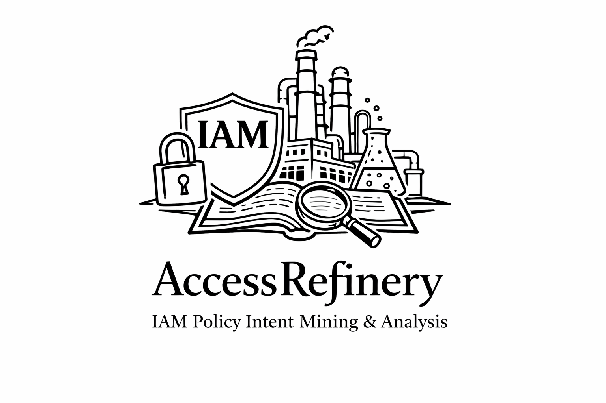

<!--
 AccessRefinery: Fast 
-->

# AccessRefinery: Fast Mining Concise Access Control Intents on Public Cloud

<!-- #   -->

## About AccessRefinery

All code, datasets (except real-world dataset), and results for the paper are contained in this repository.

Note that when browsing on an anonymous website, the page may need to be refreshed after clicking a link.

- [AccessRefinery and AWS Access Analyzer CLI version](accessrefinery/README.md)
- [Access Analyzer reproduction version](accessanalyzer/README.md)
- [Experimental Figures](experiment-figures/README.md)

<!-- Note: AWS AccessAnalyzer is accessed remotely, so only correctness experiments can be performed.
Performance experiments require a consistent environment, so we have re-implemented a version of Access Analyzer. -->

1. 功能性奖 说明可复现  
2. 可用性奖 代码结构性很好，别人可以复用
3. 公开性奖 代码挂到Zendo上面

注意：
1. 附上作者邮件，解释如何运行和安装
2. MCP解耦，AccessRefinery和MCP都附上小例子，说明如何使用
 
 
REQUIREMENTS 

STATUS

LICENSE Xijiaotong 

INSATLL
