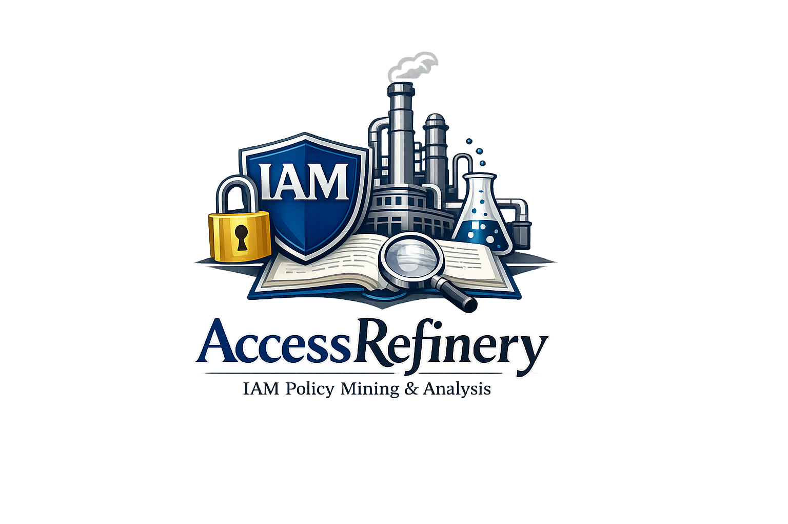

<!-- 
 AccessRefinery: Fast 
 
-->

# AccessRefinery: Fast Mining Concise Access Control Intents on Public Cloud

by [Ning Kang](https://xjtu-netverify.github.io/people/nkang/), [Peng Zhang ](https://xjtu-netverify.github.io/people/pzhang/) and [Jianyuan Zhang](https://xjtu-netverify.github.io/people/jyzhang/) at [ANTS lab](https://xjtu-netverify.github.io/).

## About AccessRefinery

AccessRefinery automatically mines access control intents from IAM (Identity and Access Management) policies. These intents help users verify the correctness and safety of their policies.

The key idea for accelerating intent mining is to reduce the redundancy of multi-round SMT solving by preprocessing constraints into bit-vector constraints using our Multi-Theory Constraint Preprocessor (MCP).
For intent reduction, AccessRefinery computes a compact set of intents that covers all mined intents by solving a min-set-cover problem. Compared with prior approaches such as AWS Access Analyzer, AccessRefinery achieves a one-to-two orders-of-magnitude speedup, and the reduced intent set is one-to-two orders-of-magnitude smaller.

In addition, the MCP module supports two extra features, both fully integrated into the tool:

- Checking implication relationships for IAM policies
- Multi-round SMT solving, equivalent to standard SMT computations

For technical details and a complete evaluation, see our FSE 2026 paper: AccessRefinery: Fast Mining Concise Access Control Intents on Public Cloud (PDF).

## Install

All code, datasets (except real-world dataset), and results for the paper are contained in this repository.

Note that when browsing on an anonymous website, the page may need to be refreshed after clicking a link.

- [AccessRefinery and AWS Access Analyzer CLI version](accessrefinery/README.md)
- [Access Analyzer reproduction version](accessanalyzer/README.md)
- [Experimental Figures](experiment-figures/README.md)

<!-- Note: AWS AccessAnalyzer is accessed remotely, so only correctness experiments can be performed.
Performance experiments require a consistent environment, so we have re-implemented a version of Access Analyzer. -->

1. 功能性奖 说明可复现  
2. 可用性奖 代码结构性很好，别人可以复用
3. 公开性奖 代码挂到Zendo上面

注意：
1. 附上作者邮件，解释如何运行和安装
2. MCP解耦，AccessRefinery和MCP都附上小例子，说明如何使用
 
 
REQUIREMENTS 

STATUS

LICENSE Xijiaotong 

INSATLL
