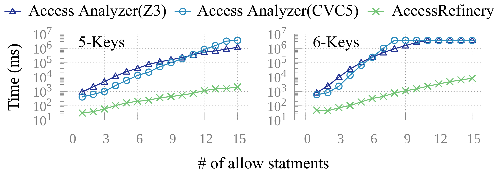
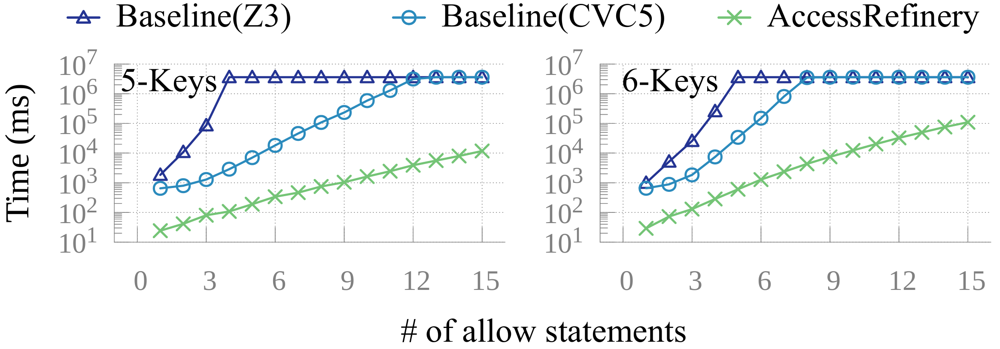
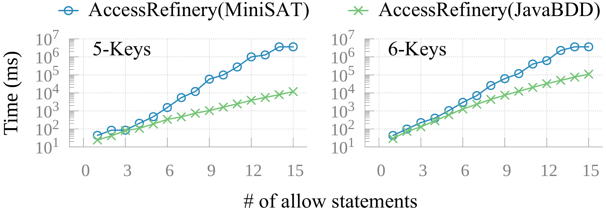
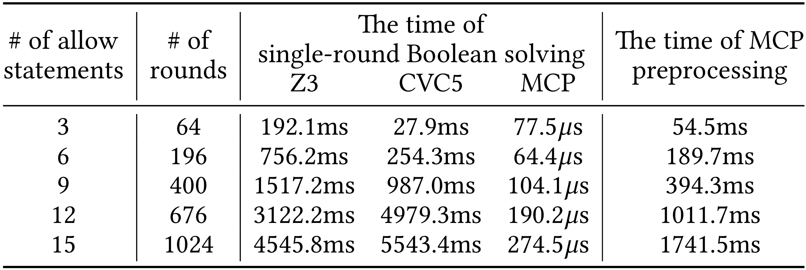

<!-- 
 AccessRefinery: Fast 
-->

<!-- <div style="display: flex; justify-content: space-between; align-items: center;">
    <h1 style="margin: 0;">AccessRefinery: Fast Mining Concise Access Control Intents on Public Cloud</h1>
    
</div> -->

# AccessRefinery: Fast Mining Concise Access Control Intents on Public Cloud

by [Ning Kang](https://xjtu-netverify.github.io/people/nkang/), [Peng Zhang](https://xjtu-netverify.github.io/people/pzhang/) and [Jianyuan Zhang](https://xjtu-netverify.github.io/people/jyzhang/) at [ANTS lab](https://xjtu-netverify.github.io/).


<!-- > Ning Kang, Peng Zhang, Jianyuan Zhang, Hao Li, Dan Wang, Zhenrong Gu, Weibo Lin, 
> Shibiao Jiang, Zhu He, Xu Du, Longfei Chen, Jun Li, and Xiaohong Guan
> "AccessRefinery: Fast Mining Concise Access Control Intents on Public Cloud", ACM FSE 2026 -->

## About AccessRefinery

**AccessRefinery** automatically mines access control intents from IAM (Identity and Access Management) policies. These intents help users verify policy correctness. Compared with [AWS Access Analyzer](https://link.springer.com/content/pdf/10.1007/978-3-030-53288-8_9.pdf), AccessRefinery accelerates mining by ~10-100x and reduces the number of intents by up to ~10x.

<!-- and its [commercial deployment](https://docs.aws.amazon.com/IAM/latest/UserGuide/access-analyzer-concepts.html) -->

To accelerate intent mining, **AccessRefinery** uses our Multi-Theory Constraint Preprocessor (MCP) to speed up multi-round SMT solving by preprocessing constraints into bit-vector constraints.  
For intent reduction, **AccessRefinery** computes a compact set that covers all mined intents by solving a minimum set-cover problem.
Moreover, we design MCP as a module separate from **AccessRefinery**, allowing other researchers to reuse MCP flexibly.

For technical details, see our FSE 2026 paper: [*AccessRefinery: Fast Mining Concise Access Control Intents on Public Cloud*](https://xjtu-netverify.github.io/papers/AccessRefinery/accessrefinery_final_version.pdf).

<!-- 
After setting up Linux, follow [Install](INSTALL.md) to install the environment, and compile **AccessRefinery** and our reproduced **Access Analyzer** (baseline). -->

## Structure

<!-- This repository includes the implementation of **AccessRefinery**, along with datasets, reproduction scripts, and archived results. -->

Since AWS Access Analyzer is not open source and provides only a CLI, we also reimplemented Access Analyzer for evaluation. We distinguish the two versions as follows:

- **Reimplemented Access Analyzer** - our reimplementation of Access Analyzer.
- **CLI-based Access Analyzer** – the AWS commercial Access Analyzer, invoked through its remote CLI API.

This repository contains the implementation of AccessRefinery and the baselines used for comparison.

- `accessrefinery/`: Implementation of **AccessRefinery**.
  - `bdd/`: Implementation of the binary decision diagram backend used by MCP.
  - `mcp/`: Implementation of the Multi-Theory Constraint Preprocessor (MCP).
  - `refinery/`: Implementation of intent mining and reduction.
- `baselines/`:
  - `accessanalyzer-reimpl`: Reimplementation of AWS Access Analyzer.
  - `accessanalyzer-cli`: Scripts for calling AWS Access Analyzer via the CLI API.
- `data/`:
  - `Correctness/`: Dataset for correctness experiments.
  - `Scalability_05Keys/`: Synthetic dataset for scalability experiments.
  - `Scalability_06Keys/`: Synthetic dataset for scalability experiments.
- `tools/`: Scripts for running the experiments.
- `pom.xml`: Maven root configuration.
- `paper_figures/`: Scripts for generating the figures in the paper.
- `archive_results/`: Archived experimental results.

<!-- For comparison, the repository also includes two AWS Access Analyzer artifacts:

- `AccessAnalyzerCLI/`: Scripts for running AWS Access Analyzer via the CLI API, along with run instructions.
- `AccessAnalyzer/`: Our reimplementation of Access Analyzer and run instructions. -->

<!-- ## Project Structure

- `accessrefinery/`: Implementation of AccessRefinery (our approach)
- `baselines/`: Compared methods
  - `accessanalyzer-reimpl/`: Our reimplementation of Access Analyzer
  - `accessanalyzer-cli/`: Scripts for the official AWS Access Analyzer CLI
- `data/`: Experimental datasets
- `tools/`: Scripts for running experiments -->

## Setup

See [Requirements](REQUIREMENTS.md) and [Installation](INSATLL.md) for AccessRefinery and the reimplemented Access Analyzer.

After compilation, the `target/` directory will contain `mcp-1.0.jar` (which can be reused in other projects for fast multi-round SMT solving), `accessrefinery-1.0.jar` (AccessRefinery), and `accessanalyzer-1.0.jar` (Reimplemented Access Analyzer).

> It is strongly recommended that you skip installing the CLI-based Access Analyzer because its setup is complex (AWS account registration, billing setup, and CLI credential configuration). Instead, we provide archived results for the CLI-based Access Analyzer. We also provide CLI installation instructions for developers.

## Using Multi-Theory Constraint Preprocessor (MCP)

MCP is a data structure for fast multi-round SMT solving. It supports regular expressions, IP prefixes/bit-vectors, ranges, and sets.

### Reuse in Another Project

Follow [Install](INSTALL.md) to generate the JAR package. Recall that:

```bash
mvn clean package
```

This generates `target/mcp-1.0.jar`. Install it into your local Maven repository:

```bash
mvn install:install-file \
    -Dfile=target/mcp-1.0.jar \
    -DgroupId=org.ants \
    -DartifactId=accessrefinery \
    -Dversion=1.0 \
    -Dpackaging=jar \
    -DgeneratePom=true
```

Then add the dependency to your `pom.xml`:

```xml
<dependencies>
    <dependency>
        <groupId>org.ants</groupId>
        <artifactId>accessrefinery</artifactId>
        <version>1.0</version>
    </dependency>
</dependencies>
```

### Example

This example follows the example in the paper (line 375).
Suppose we have the following IAM policy and a target intent, `Intent_6` (`Resource`: `dept*/user1.txt`, `IpAddress`: `112.0.0.0/24`).

```json
{
    "Statement": [
        {
            "Effect": "Allow",
            "Resource": ["dept*/user1.txt", "dept1/user*.txt"],
            "Condition": {
                "IpAddress": {
                    "aws:SourceIp": ["112.0.0.0/24", "113.0.0.0/24"]
                }
            }
        },
        {
            "Effect": "Deny",
            "NotResource": "dept1/user*.txt",
            "Condition": {
                "IpAddress": {
                    "aws:SourceIp": "112.0.0.0/24"
                }
            }
        },
        {
            "Effect": "Deny",
            "NotResource": "dept*/user1.txt",
            "Condition": {
                "IpAddress": {
                    "aws:SourceIp" : "113.0.0.0/24"
                }
            }
        }
    ]
}
```

Moreover, suppose our goal is to check the satisfiability of three formulas: $\neg I_6 \land P$, $I_6 \land \neg P$, and $I_6 \land P$. The corresponding MCP code is shown below.
The example is also included in [MCPFactoryTest.java](projects/mcp/src/test/java/org/mcp/core/MCPFactoryTest.java) and runs automatically during `mvn package`.

```java
package com.example;
import org.batfish.datamodel.Prefix;
import org.junit.Assert;
import org.mcp.core.MCPBitVector;
import org.mcp.core.MCPFactory;
import org.mcp.core.MCPFactory.MCPType;
import org.mcp.variables.statics.LabelType;

public class Main {
    public static void main(String[] args) {
        MCPFactory mcp = new MCPFactory(MCPType.BDD);
        mcp.addVar("Res", LabelType.REGEXP, "dept*/user1.txt");
        mcp.addVar("Res", LabelType.REGEXP, "dept1/user*.txt");
        mcp.addVar("IP", LabelType.PREFIX, Prefix.parse("112.0.0.0/24"));
        mcp.addVar("IP", LabelType.PREFIX, Prefix.parse("113.0.0.0/24"));
        mcp.updates();

        MCPBitVector res1 = mcp.getVar("Res", "dept*/user1.txt");
        MCPBitVector res2 = mcp.getVar("Res", "dept1/user*.txt");
        MCPBitVector ip1 = mcp.getVar("IP", Prefix.parse("112.0.0.0/24"));
        MCPBitVector ip2 = mcp.getVar("IP", Prefix.parse("113.0.0.0/24"));
        MCPBitVector s1 = (res1.or(res2)).and(ip1.or(ip2));
        MCPBitVector s2 = res1.not().and(ip1);
        MCPBitVector s3 = res2.not().and(ip2);
        MCPBitVector policy = s1.diff(s2).diff(s3);
        MCPBitVector intent6 = res1.and(ip1);

        // ¬I6∧P is satisfiable.
        Assert.assertTrue(!policy.and(intent6.not()).isZero());
        // I6∧¬P is unsatisfiable.
        Assert.assertTrue(policy.not().and(intent6).isZero());
        // I6∧P is satisfiable.
        Assert.assertTrue(!policy.and(intent6).isZero());
    }
}
```

## Using AccessRefinery

**AccessRefinery** builds on MCP for IAM intent mining and reduction. In this repository, MCP is already integrated into **AccessRefinery**, so you can use it directly without a separate installation.

Follow [Install](INSTALL.md) to build the JAR package:

```shell
mvn clean package
```

To run **AccessRefinery**, use:

```shell
java -jar target/refinery-1.0.jar [options]
```

**Command-line options:**

- `-h, --help` : Show help information.
- `-m, --mine` : Enable intent mining.
- `-r, --reduce` : Enable intent reduction.
- `-f, --file <path>` : Input path for policy files (must be under `data/`).
- `-s, --sat` : Use SAT to encode bit-vectors (default is BDD).
- `--round <number>` : Number of mining rounds (to reduce experimental bias).

**Example:**

```shell
java -jar target/accessrefinery-1.0.jar -m -r --round 1 -f data/Correctness
```

The command produces logs similar to the following:

```cmd
[INFO] 2026-04-05 22:51:33 : ----------[ AccessRefinery Mode ]-------------
[INFO] 2026-04-05 22:51:33 : input  path: data/Correctness
[INFO] 2026-04-05 22:51:33 : output path: result/Correctness
[INFO] 2026-04-05 22:51:33 : ----------< 1th policy - 11_allow_allow_equal.json >-----------
[INFO] 2026-04-05 22:51:33 : [1/6]  finish parser policy
[INFO] 2026-04-05 22:51:33 : [2/6]  finish ECs calculation
...
```

After processing all policies, results are generated in the `results/Correctness/` directory. The output includes:

- `xxx.json`: The generated intents for each policy.
- `xxx.csv`: Statistics for multi-round SMT solving for each policy.
- `summary.txt`: Summary statistics for all policies in a folder.

In addition, one file is generated in the current path:

- `accessrefinery.log` : Records the running log.

## Evaluation Reproduction

This section explains how to reproduce the results of **AccessRefinery** and the **Reimplemented Access Analyzer** reported in the paper.

> Recall that we recommend skipping the reproduction of the CLI-based Access Analyzer. However, you can still verify the evaluation results reported in the paper, since all experimental results are archived in `archive_result/`.

### Running AccessRefinery

The following scripts reproduce the AccessRefinery results and automatically invoke `target/refinery-1.0.jar`.

```bash
sh tools/running_bdd_miner.sh
sh tools/running_sat_miner.sh
sh tools/running_bdd_reducer.sh
sh tools/running_sat_reducer.sh
```

The following folders will be generated under `result/`. The difference between `bdd_` and `sat_` is the backend used to represent bit-vectors. The suffix `10rs` means the experiment is run for 10 rounds and the average is reported. Because `accessrefinery_sat_reducer_3rs` runs very slowly, we report results for only three rounds.

- `accessrefinery_bdd_miner_10rs/`: Intent mining results for 10 rounds with JavaBDD.
- `accessrefinery_sat_miner_10rs/`: Intent mining results for 10 rounds with MiniSAT.
- `accessrefinery_bdd_reducer_10rs/`: Intent mining and reduction results for 10 rounds with JavaBDD.
- `accessrefinery_sat_reducer_3rs/`: Intent mining and reduction results for 3 rounds with MiniSAT.

### Running Re-implemented Access Analyzer

### Correspondence to Paper Sections

After generating the experimental results, we explain how to reproduce the figures, tables, and conclusions reported in the paper.

### 5 Experiment Setup

**Target:** "*AWS provides an online Command Line Interface (CLI) for Access Analyzer, which we use to validate the correctness of our re-implementation. Specifically, for the 6-key dataset with 13 to 15 statements, both versions time out (> 1 hour). Both versions produce identical intents on the Correctness, 5-key, and 6-key datasets.*"

**Reproduced Steps:**

//Todo @after-the-end

---

### 6.1 Is AccessRefinery correct?

#### Correctness of MCP

**Target:** "*We conducted a series of basic Boolean operation tests.*"

**Reproduced Steps:**

Basic Boolean operations are tested in [MCPTest.java](projects/mcp/src/test/java/org/mcp/core/MCPTest.java). These tests run automatically during `mvn package`.

---

#### Correctness of Intent Miner

**Target:** Figure 10 in the paper


**Required logs**:
Use the `NumberMCI` values in `accessrefinery_bdd_miner_10rs/Correctness/summary.txt` to plot Figure 10 of the paper.

**Target:** "*We compared the intents produced by AccessRefinery (without intent reduction), our re-implementation of Access Analyzer, and the AWS Access Analyzer via the CLI API. On synthetic datasets, all three produce the same set of intents.*"

**Required Steps:**

The following commands check whether the intents mined by AccessRefinery are consistent with those from AWS Access Analyzer (via CLI). Logs are generated in `result/compare_accessrefinery_with_accessanalyzer_cli/`:

```bash
sh tools/running_batch_compare.sh
```
---

#### Correctness of Intent Reducer

**Target:** "*(1) The reduced intents fully cover the policy. (2) Removing any intent from the reduced intents causes the remaining intents to no longer cover the policy.*"

Required Steps:

//Todo @after-the-end

---

### Section 6.2 Can AccessRefinery reduce the number of intents?

**Target**: Figure 11 in the paper.


**Required logs**:

- `accessrefinery_bdd_reducer_10rs/`
  - `Scalability_05Keys/summary.txt`
  - `Scalability_06Keys/summary.txt`

The `NumberMCI` column represents the number of intents before reduction, and the `NumberRRI` column represents the number after reduction.

> Note: The real-world results in the paper cannot be open sourced for commercial reasons.

---

### Section 6.3 Can AccessRefinery speed up intent mining and reduction by using MCP?

**Target**: Figure 12 in the paper.



**Required logs**:

- `accessrefinery_bdd_miner_10rs/`
  - `Scalability_05Keys/summary.txt`
  - `Scalability_06Keys/summary.txt`

The `TotalTimeAverage` column represents the average runtime over 10 rounds.

---

**Target**: Figure 13 in the paper.



**Required logs**:

- `accessrefinery_bdd_reducer_10rs/`
  - `Scalability_05Keys/summary.txt`
  - `Scalability_06Keys/summary.txt`

The `TotalTimeAverage` column represents the average runtime over 10 rounds.

---

### Section 6.4 How does AccessRefinery perform on real-world datasets?

These logs are omitted for commercial reasons.

---

### Section 6.5 Is SAT or BDD better for intent mining and reduction?

**Target (Intent Mining)**:
"For intent mining, using JavaBDD is 1-6x faster than using MiniSAT (for clarity, the figure is omitted)."

**Required logs (Intent Mining)**:

- `accessrefinery_bdd_miner_10rs/`
  - `Scalability_05Keys/summary.txt`
  - `Scalability_06Keys/summary.txt`
- `accessrefinery_sat_miner_10rs/`
  - `Scalability_05Keys/summary.txt`
  - `Scalability_06Keys/summary.txt`

The `TotalTimeAverage` column represents the average runtime over 10 rounds.

---

**Target (Intent Reduction)**: Figure 15 in the paper.



**Required logs (Intent Reduction)**:

- `accessrefinery_bdd_reducer_10rs/`
  - `Scalability_05Keys/summary.txt`
  - `Scalability_06Keys/summary.txt`
- `accessrefinery_sat_reducer_3rs/`
  - `Scalability_05Keys/summary.txt`
  - `Scalability_06Keys/summary.txt`

For a fair comparison, compare average runtime per round using `TotalTimeAverage / rounds`. Since SAT-based reduction is much slower, we report SAT results for only 3 rounds.

---

### Section 6.6 How does AccessRefinery accelerate single-round solving in multi-round SMT solving compared to SMT solvers?

**Target**: Table 2 in the paper.



**Required logs**:

- `accessrefinery_bdd_miner_10rs/`
  - `Scalability_05Keys/`
  - `Scalability_06Keys/`

`MCILabelsTimeAverage` is the average MCP preprocessing time.
`NumberRRI` is the number of reduced intents.

---

### Drawing the figures in the paper

The following commands install `gnuplot` and generate all figures used in the experiments.
The generated figures are saved in `paper_figures/results/`.

```shell
sudo apt install gnuplot
cd paper_figures
sh draw.sh
```

## Contact

- Ning Kang (<kangning2018@qq.com>)
- Peng Zhang (<p-zhang@xjtu.edu.cn>)

## License

Apache-2.0 License, see [LICENSE](LICENSE).
