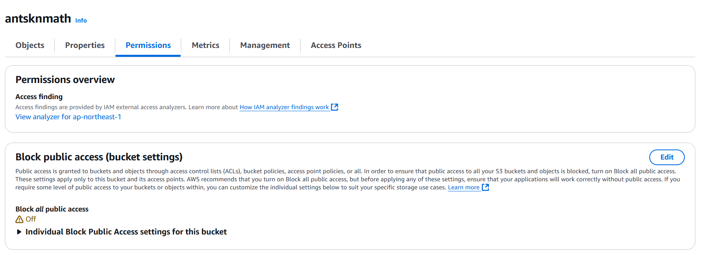
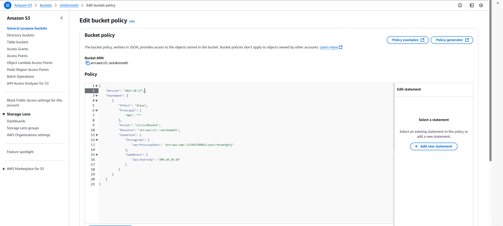

# Running AWS Access Analyzer via CLI

This guide explains how to use the scripts to invoke **AWS Access Analyzer** via CLI and mine intents.

## Prerequisites

1. Create an AWS account.
2. Configure your AWS access keys as described in [this reference](https://docs.aws.amazon.com/cli/latest/userguide/cli-authentication-user.html?utm_source=chatgpt.com).
3. Create an S3 bucket and attach a **resource-based** bucket policy.
    > **Note**: Identity-based policies do not generate findings.

    > Ensure **Block all public access** is disabled for the bucket.

    
    

4. Install AWS CLI:

    ```bash
    sudo apt install awscli
    ```

5. Verify the installation:

    ```bash
    aws help
    ```

6. Configure AWS credentials:

    ```bash
    aws configure
    ```

    Example:

    ```bash
    AWS Access Key ID [None]: <YOUR_ACCESS_KEY_ID>
    AWS Secret Access Key [None]: <YOUR_SECRET_ACCESS_KEY>
    Default region name [None]: ap-northeast-1
    Default output format [None]: json
    ```

---

## Run AWS Access Analyzer

Use **aws_batch.sh** (inspired by [Invoking AWS Access Analyzer via CLI](https://github.com/aws-samples/aws-iam-access-analyzer-samples)) to invoke Access Analyzer and mine intents.

```bash
sh baselines/accessanalyzer-cli/aws_batch.sh <input_dir> <timeout_seconds>
```

- `input_dir`: policy directory under `data/`
- `timeout_seconds`: timeout value in seconds

Outputs are written to `results/accessanalyzer_cli/`.

## Reproducing Archived Results

Run the following commands to reproduce the archived results:

```bash
sh baselines/accessanalyzer-cli/aws_batch.sh data/Correctness 3600
sh baselines/accessanalyzer-cli/aws_batch.sh data/Scalability_05Keys 3600
sh baselines/accessanalyzer-cli/aws_batch.sh data/Scalability_06Keys 3600
```
