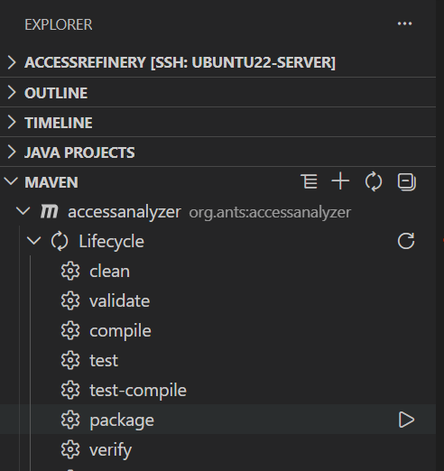

# VS Code Developer Guide

After verifying the environment in the terminal, follow these steps to import, build, and debug the project in VS Code.

## 1. Import and Verify Java Projects

After opening the repository root, wait for the Java extension to finish indexing. In the `JAVA PROJECTS` view on the left sidebar of VS Code, confirm the following modules are loaded:

- `accessanalyzer`
- `accessrefinery`
- `bdd`
- `mcp`
- `refinery`

Then click the `Rebuild All` button.

## 2. Build via Maven View

In the `MAVEN` view on the left sidebar, click the `Reload All Maven Projects` button.

Expand the project you want to build (e.g., `accessanalyzer` or `refinery`) and navigate to `Lifecycle`. You will see available targets such as `clean`, `compile`, `test`, `package`, etc.

## 3. Run Package

Click the run button next to `package` in the `Lifecycle` section.

After successful execution, the built artifacts will be generated in the `target/` directory (e.g., `accessrefinery-1.0.jar`, `accessanalyzer-1.0.jar`, etc.).

## 4. Run and Debug

Open the `Run and Debug` view (Ctrl+Shift+D), select a debug configuration (e.g., `AccessRefinery`), and click the green run button to start debugging.

While debugging, you can set breakpoints in the source code and inspect the program state using the `VARIABLES`, `CALL STACK`, and `BREAKPOINTS` panels.

## 5. Troubleshooting

- **Issue:** `Cannot resolve modulepaths/classpaths automatically`
  - **Solution:** Ensure `.vscode/launch.json` does not have hardcoded `classPaths` or `modulePaths`. Let Maven/VS Code handle the classpath automatically.

- **Issue:** Z3-related runtime errors
  - **Solution:** Run `sh tools/install_z3.sh` first, then open a new terminal and run again.