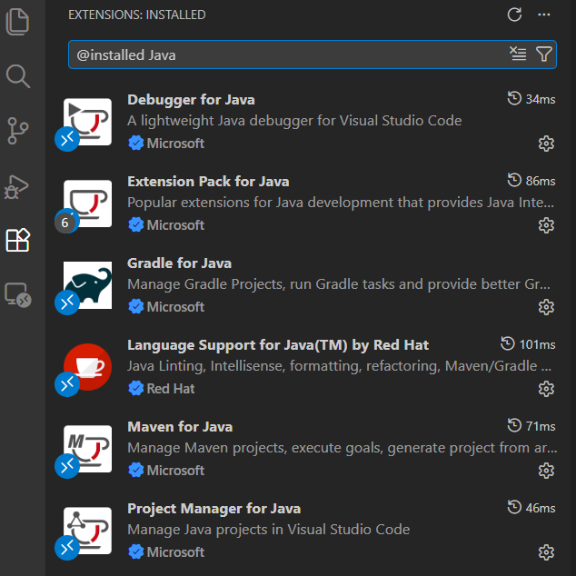
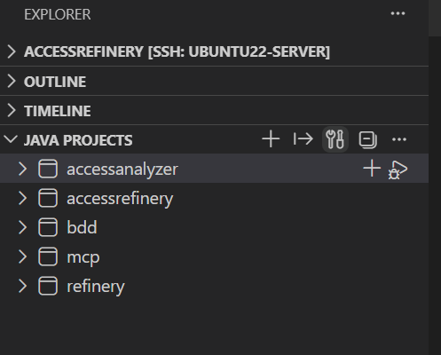
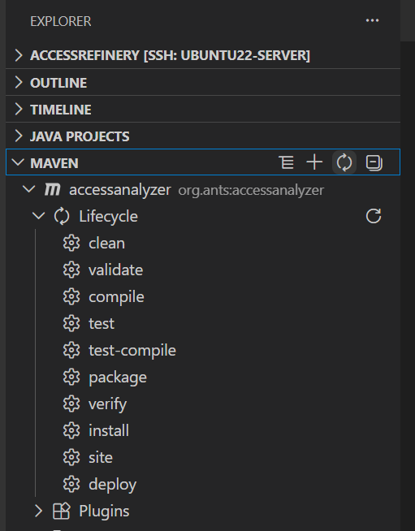
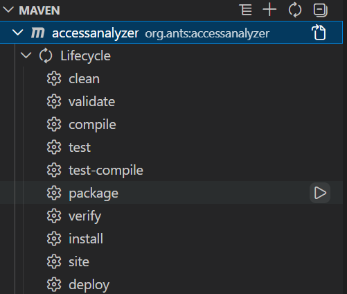
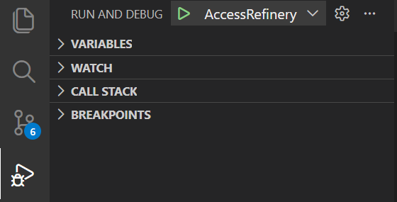
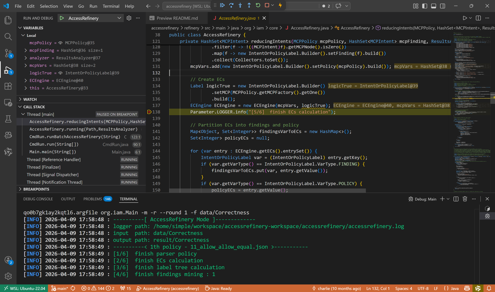

# VS Code Developer Guide

After verifying the environment in the terminal, follow these steps to import, build, and debug the project in VS Code.

## 1. Install VS Code Extensions

Install the following extensions from the `Extensions` view in the left sidebar of VS Code.

## 2. Import Java Projects

After opening the repository root, wait for the Java extension to finish indexing. In the `JAVA PROJECTS` view on the left sidebar of VS Code, confirm that all project modules are loaded, and then click the `Rebuild All` button:

## 3. Build via Maven View

In the `MAVEN` view on the left sidebar, click the `Reload All Maven Projects` button.

## 4. Run the Package Goal

In the `MAVEN` view, expand the target project and navigate to `Lifecycle`. You will see available goals such as `clean`, `compile`, `test`, and `package`. Click the Run button next to the `package` goal.

After successful execution, artifacts are generated in the `target/` directory (e.g., `accessrefinery-1.0.jar` and `accessanalyzer-1.0.jar`).

## 5. Run and Debug

Open the `Run and Debug` view (`Ctrl+Shift+D`), select a debug configuration (e.g., `AccessRefinery`), and click the green run button to start debugging.

While debugging, you can set breakpoints in the source code and inspect the program state using the `VARIABLES`, `CALL STACK`, and `BREAKPOINTS` panels.

## Troubleshooting

- **Issue:** `Cannot resolve module path/classpath automatically`
  - **Solution:** Ensure `.vscode/launch.json` does not contain hardcoded `classPaths` or `modulePaths`. Let Maven and VS Code handle the classpath automatically.

- **Issue:** Z3-related runtime errors
  - **Solution:** Run `sh tools/install_z3.sh` first, then open a new terminal and run again.